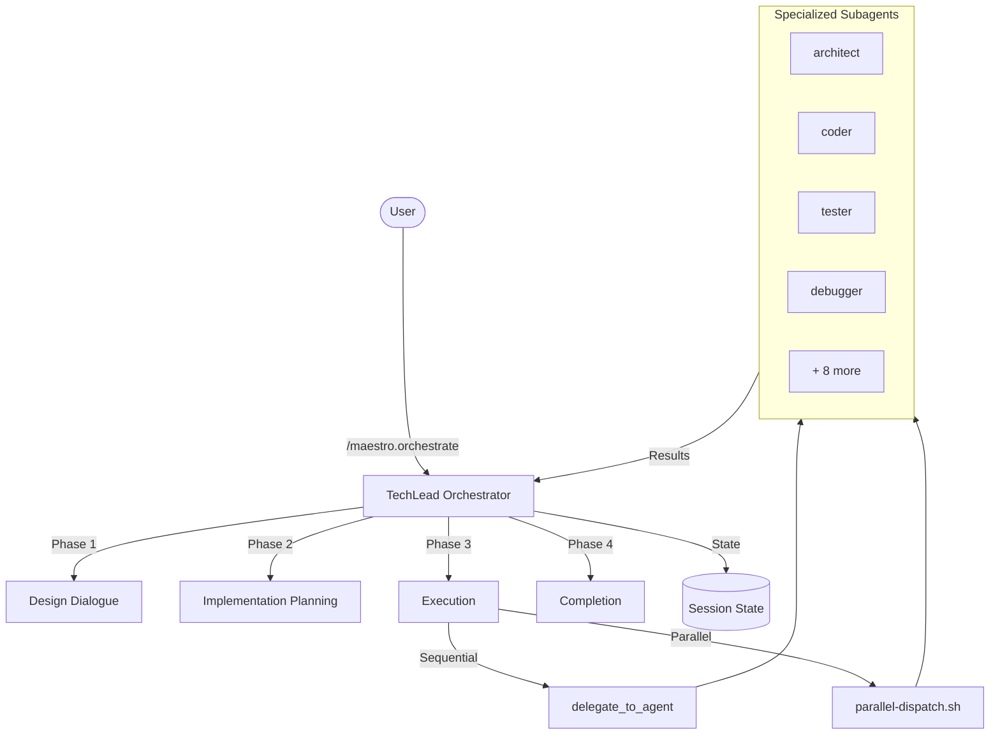

# Maestro

[](https://github.com/josstei/maestro-gemini/releases)
[](LICENSE)
[](https://geminicli.com)

Multi-agent orchestration extension for Gemini CLI. Maestro assembles specialized development teams and coordinates them through structured design, planning, and execution workflows — plus standalone commands for code review, debugging, security auditing, and performance analysis.

## Overview

Maestro transforms Gemini CLI into a multi-agent orchestration platform. Instead of a single AI session handling everything, Maestro delegates work to 12 specialized subagents — each with its own context, tools, and expertise — coordinated by a TechLead orchestrator.

### Key Capabilities

- **Guided Design Dialogue** — Structured requirements gathering with multiple-choice questions and architectural approach proposals
- **Automated Planning** — Generates implementation plans with phase dependencies, agent assignments, and parallelization opportunities
- **Parallel Execution** — Independent phases run concurrently through shell-based parallel dispatch
- **Session Persistence** — All orchestration state tracked in YAML+Markdown files for reliable resumption
- **Least-Privilege Security** — Each subagent receives only the tools required for its role
- **Standalone Commands** — Direct access to code review, debugging, security audit, and performance analysis without full orchestration
- **Configurable Settings** — 10 environment-variable-driven parameters for model selection, timeouts, validation strictness, and more

## Architecture

### Orchestration Flow



### Seven-Layer Component Model

| Layer | Directory | Format | Purpose |
|-------|-----------|--------|---------|
| **Orchestrator** | `GEMINI.md` | Markdown | TechLead persona, phase transitions, delegation rules |
| **Commands** | `commands/` | TOML | CLI command definitions mapping user commands to prompts/skills |
| **Agents** | `agents/` | Markdown + YAML frontmatter | 12 subagent persona definitions with tool permissions and model config |
| **Skills** | `skills/` | Markdown (`SKILL.md` per directory) | Reusable methodology modules activated on demand |
| **Protocols** | `protocols/` | Markdown | Shared behavioral contracts injected into delegation prompts |
| **Scripts** | `scripts/` | Shell | Execution infrastructure (parallel dispatch) |
| **Templates** | `templates/` | Markdown | Structure templates for generated artifacts (designs, plans, sessions) |

## Getting Started

### Prerequisites

Maestro relies on Gemini CLI's experimental subagent system. Enable it in your Gemini CLI settings:

```json
{
  "experimental": {
    "enableAgents": true
  }
}
```

> **Warning**: Subagents are experimental and operate in YOLO mode — they execute tools (shell commands, file writes) without individual confirmation for each step. Review the [subagents documentation](https://geminicli.com/docs/core/subagents/) for details.

The `settings.json` file is located at:
- **macOS/Linux**: `~/.gemini/settings.json`
- **Windows**: `%USERPROFILE%\.gemini\settings.json`

Maestro checks for subagent support on startup and offers to enable it if missing.

### Installation

**From Git Repository:**

```bash
gemini extensions install https://github.com/josstei/maestro-gemini
```

**Local Development:**

```bash
git clone https://github.com/josstei/maestro-gemini
cd maestro-gemini
gemini extensions link maestro/
```

Restart Gemini CLI after installation for the extension to load.

### Quick Start

```
/maestro.orchestrate Build a REST API for a task management system with user authentication
```

Maestro will:
1. Engage you in a structured design dialogue
2. Present 2-3 architectural approaches with trade-offs
3. Generate a design document for your approval
4. Create a detailed implementation plan with agent assignments
5. Execute the plan phase by phase, delegating to specialized agents
6. Track all progress in session state files

## Configuration

### Extension Settings

Maestro provides 10 configurable settings that control agent behavior, workflow preferences, and execution parameters. Configure them via:

```bash
gemini extensions config maestro
```

| Setting | Environment Variable | Default | Description |
|---------|---------------------|---------|-------------|
| Default Model | `MAESTRO_DEFAULT_MODEL` | `gemini-3-pro-preview` | Model used by all agents unless individually overridden |
| Writer Model | `MAESTRO_WRITER_MODEL` | `gemini-3-flash-preview` | Model for technical-writer agent |
| Default Temperature | `MAESTRO_DEFAULT_TEMPERATURE` | `0.2` | Temperature for all agents (0.0-1.0) |
| Max Agent Turns | `MAESTRO_MAX_TURNS` | `25` | Maximum turns per subagent execution |
| Agent Timeout | `MAESTRO_AGENT_TIMEOUT` | `10` | Timeout in minutes per subagent |
| Disabled Agents | `MAESTRO_DISABLED_AGENTS` | _(none)_ | Comma-separated list of agents to exclude |
| Max Retries | `MAESTRO_MAX_RETRIES` | `2` | Retry attempts per phase before escalation |
| Auto Archive | `MAESTRO_AUTO_ARCHIVE` | `true` | Archive sessions on completion |
| Validation Strictness | `MAESTRO_VALIDATION_STRICTNESS` | `normal` | `strict` / `normal` / `lenient` |
| State Directory | `MAESTRO_STATE_DIR` | `.gemini` | Directory for session state and plans |

Defaults are fallback values enforced by the orchestrator when a setting is not configured.

### Theme

Maestro includes a branded dark theme with warm gold accents. After installing the extension, select it from the Gemini CLI theme picker:

```
Theme: Maestro (maestro)
```

### Model Configuration

| Role | Model | Purpose |
|------|-------|---------|
| Primary | `gemini-3-pro-preview` | All agents requiring strong reasoning |
| Cost-optimized | `gemini-3-flash-preview` | technical-writer agent |
| Fallback | `gemini-2.5-pro` | When Gemini 3 models are unavailable |

Override the primary model for all agents via `MAESTRO_DEFAULT_MODEL`, or just the writer via `MAESTRO_WRITER_MODEL`.

## Commands

### /maestro.orchestrate

Initiates the full Maestro orchestration workflow.

**Usage**: `/maestro.orchestrate <task description>`

**Behavior**:
1. Checks for existing active sessions in `.gemini/state/`
2. If an active session exists, offers to resume or archive it
3. Begins the four-phase orchestration workflow:
   - Phase 1: Design Dialogue
   - Phase 2: Team Assembly & Planning
   - Phase 3: Execution
   - Phase 4: Completion & Archival

### /maestro.resume

Resumes an interrupted orchestration session.

**Usage**: `/maestro.resume`

**Behavior**:
1. Reads `.gemini/state/active-session.md` directly via file injection
2. Parses session metadata and phase statuses
3. Presents a status summary with completed/pending/failed phases
4. If errors exist from the previous run, presents them and asks for guidance
5. Continues execution from the last active phase using the execution and delegation skills

### /maestro.execute

Executes an existing implementation plan, skipping design and planning phases.

**Usage**: `/maestro.execute <path-to-implementation-plan>`

**Behavior**:
1. Reads the specified implementation plan file
2. Creates a session state file for tracking
3. Presents an execution summary for user confirmation
4. Executes phases according to the plan with full progress tracking
5. Archives the session on completion

### /maestro.review

Runs a standalone code review on staged changes, last commit, or specified paths.

**Usage**: `/maestro.review [file paths or glob patterns]`

**Behavior**:
1. Auto-detects review scope: user-specified paths > staged changes > last commit diff
2. Confirms detected scope with the user
3. Delegates to the code-reviewer agent
4. Presents findings classified by severity (Critical, Major, Minor, Suggestion)
5. Every finding references a specific file and line number

### /maestro.debug

Focused debugging session to investigate and diagnose an issue.

**Usage**: `/maestro.debug <issue description>`

**Behavior**:
1. Delegates to the debugger agent with the issue description
2. Follows systematic methodology: reproduce, hypothesize, investigate, isolate, verify
3. Presents root cause analysis with evidence, execution trace, and recommended fix

### /maestro.security-audit

Runs a security assessment on the specified scope.

**Usage**: `/maestro.security-audit <scope>`

**Behavior**:
1. Delegates to the security-engineer agent
2. Reviews for OWASP Top 10 vulnerabilities, traces data flow, audits authentication/authorization
3. Presents findings with CVSS-aligned severity, proof of concept, and remediation steps

### /maestro.perf-check

Runs a performance analysis on the specified scope.

**Usage**: `/maestro.perf-check <scope>`

**Behavior**:
1. Delegates to the performance-engineer agent
2. Establishes baseline, profiles hotspots, analyzes bottlenecks
3. Presents optimization recommendations ranked by impact-to-effort ratio

### /maestro.status

Displays the current orchestration session status.

**Usage**: `/maestro.status`

**Behavior**:
1. Reads the active session state via file injection
2. Presents phase-by-phase status, file manifest, token usage, and errors
3. Read-only — does not modify state or continue execution

### /maestro.archive

Archives the current active orchestration session.

**Usage**: `/maestro.archive`

**Behavior**:
1. Checks for an active session
2. Presents a summary and asks for confirmation
3. Moves design document, implementation plan, and session state to archive directories
4. Verifies archival was successful

## Parallel Execution

Maestro 1.1.0 introduces shell-based parallel dispatch, enabling independent implementation phases to run concurrently instead of sequentially.

### How It Works

The TechLead orchestrator uses `scripts/parallel-dispatch.sh` to spawn concurrent Gemini CLI processes that execute independently. This bypasses the sequential `delegate_to_agent` tool scheduler, which processes one tool call at a time.

**Dispatch flow:**
1. The orchestrator writes self-contained delegation prompts to a dispatch directory
2. Invokes `parallel-dispatch.sh` via shell
3. The script spawns one `gemini -p <prompt> --yolo --output-format json` process per prompt file
4. All agents execute concurrently as independent OS processes
5. Results are collected with exit codes, logs, and structured JSON output
6. The orchestrator reads results and updates session state

### When to Use Each Mode

| Use Parallel Dispatch | Use Sequential `delegate_to_agent` |
|---|---|
| Phases at the same dependency depth | Phases with shared file dependencies |
| Non-overlapping file ownership | Phases that may need interactive clarification |
| Fully self-contained prompts | Single-phase execution |
| Batch size of 2-4 agents | Fallback when parallel dispatch fails |

### Dispatch Directory Structure

```
<state_dir>/parallel/<batch-id>/
├── prompts/
│   ├── agent-a.txt          # Full delegation prompt
│   └── agent-b.txt
└── results/
    ├── agent-a.json          # Structured JSON output
    ├── agent-a.exit          # Exit code (0=success, 124=timeout)
    ├── agent-a.log           # stderr/debug output
    ├── agent-b.json
    ├── agent-b.exit
    ├── agent-b.log
    └── summary.json          # Batch summary with status per agent
```

### Environment Overrides

| Variable | Effect on Parallel Dispatch |
|----------|---------------------------|
| `MAESTRO_DEFAULT_MODEL` | Passed as `-m` flag to all spawned Gemini processes |
| `MAESTRO_AGENT_TIMEOUT` | Controls per-agent timeout (default: 10 minutes) |

### Constraints

Parallel agents run as independent CLI processes with no shared context. Each prompt must be complete and self-contained — agents cannot ask follow-up questions or access results from other agents in the same batch.

## Agent Roster

Maestro coordinates 12 specialized subagents:

| Agent | Specialization | Tools | Model |
|-------|---------------|-------|-------|
| architect | System design, technology selection, component design | read, glob, search, web search | Pro |
| api-designer | REST/GraphQL endpoint design, API contracts | read, glob, search | Pro |
| coder | Feature implementation, clean code, SOLID principles | read, glob, search, write, replace, shell | Pro |
| code-reviewer | Code quality review, best practices, security | read, glob, search | Pro |
| data-engineer | Schema design, query optimization, ETL pipelines | read, glob, search, write, replace, shell | Pro |
| debugger | Root cause analysis, log analysis, execution tracing | read, glob, search, shell | Pro |
| devops-engineer | CI/CD pipelines, containerization, infrastructure | read, glob, search, write, replace, shell | Pro |
| performance-engineer | Profiling, bottleneck identification, optimization | read, glob, search, shell | Pro |
| refactor | Code modernization, technical debt, design patterns | read, glob, search, write, replace | Pro |
| security-engineer | Vulnerability assessment, OWASP, threat modeling | read, glob, search, shell | Pro |
| tester | Unit/integration/E2E tests, TDD, coverage analysis | read, glob, search, write, replace, shell | Pro |
| technical-writer | API docs, READMEs, architecture documentation | read, glob, search, write, replace | Flash |

### Tool Access Philosophy

- **Read-only agents** (architect, api-designer, code-reviewer): Produce analysis and recommendations
- **Read + Shell agents** (debugger, performance-engineer, security-engineer): Investigate without modifying files
- **Read + Write agents** (refactor, technical-writer): Modify code/docs without shell access
- **Full access agents** (coder, data-engineer, devops-engineer, tester): Complete implementation capabilities

## Skills

Maestro uses skills to encapsulate detailed methodologies that are activated on demand, keeping the base context lean.

| Skill | Purpose | Activated By |
|-------|---------|-------------|
| `design-dialogue` | Structured requirements gathering and architectural design convergence | `/maestro.orchestrate` (Phase 1) |
| `implementation-planning` | Phase decomposition, agent assignment, and plan generation | `/maestro.orchestrate` (Phase 2) |
| `execution` | Phase execution protocols, error handling, and completion workflows | `/maestro.orchestrate` (Phase 3), `/maestro.execute`, `/maestro.resume` |
| `delegation` | Subagent prompt construction, scope boundaries, and parallel delegation | Any phase involving subagent delegation |
| `session-management` | Session creation, state updates, resume protocol, and archival | `/maestro.orchestrate`, `/maestro.resume`, `/maestro.archive`, `/maestro.status` |
| `code-review` | Scope detection, severity classification, and structured review output | `/maestro.review` |
| `validation` | Build/lint/test pipeline, project type detection, and result interpretation | Post-phase validation during execution |

## Orchestration Workflow

### Phase 1: Design Dialogue

The TechLead engages you in a structured conversation to understand requirements:
- Asks one question at a time, preferring multiple-choice format
- Covers problem scope, constraints, technology preferences, quality requirements, and deployment context
- Presents 2-3 architectural approaches with pros, cons, and recommendations
- Builds the design document section by section, validating each with you

### Phase 2: Team Assembly & Planning

After design approval, the TechLead:
- Analyzes the design for components, interfaces, and dependencies
- Assigns phases to specialized agents based on task domain
- Identifies parallel execution opportunities
- Generates a detailed implementation plan for your approval

### Phase 3: Execution

With plan approval, the TechLead:
- Delegates work to subagents phase by phase
- Runs parallel phases concurrently when dependencies allow
- Updates session state after each phase completion
- Handles errors with up to 2 automatic retries before escalating

### Phase 4: Completion

After all phases complete:
- Final review of all deliverables
- Session state marked as completed
- Plans and state files archived to `archive/` subdirectories
- Summary delivered with files changed, token usage, and next steps

## Project Output Structure

Maestro creates the following directories in your project:

```
<your-project>/
└── .gemini/
    ├── plans/                          # Active design docs and implementation plans
    │   ├── archive/                    # Completed plans
    │   ├── YYYY-MM-DD-<topic>-design.md
    │   └── YYYY-MM-DD-<topic>-impl-plan.md
    └── state/                          # Session tracking
        ├── archive/                    # Completed sessions
        └── active-session.md           # Current orchestration state
```

## Session State

Maestro tracks orchestration progress in `.gemini/state/active-session.md` with:

- **Phase status tracking**: pending, in_progress, completed, failed, skipped
- **File manifest**: Files created, modified, and deleted per phase
- **Error tracking**: Per-phase error logs with retry counts and resolution records
- **Token usage**: Per-agent, per-phase token consumption metrics

All state files use YAML frontmatter for machine-readable metadata and Markdown body for human-readable logs.

## Troubleshooting

### Extension Not Loading

1. Verify the extension is linked: `gemini extensions list`
2. Restart Gemini CLI after installation or linking
3. Check `gemini-extension.json` exists in the maestro directory

### /maestro.orchestrate Not Responding

1. Ensure GEMINI.md is present in the maestro directory
2. Check that `commands/maestro.orchestrate.toml` exists
3. Restart Gemini CLI

### Session Resume Fails

1. Verify `.gemini/state/active-session.md` exists in your project
2. Check the YAML frontmatter is valid (no syntax errors)
3. If corrupted, manually fix the YAML or delete and start fresh with `/maestro.orchestrate`

### Subagent Errors

- Maestro automatically retries failed phases up to 2 times
- If retries are exhausted, you'll be asked for guidance
- Check the session state file for detailed error logs
- Common causes: file conflicts, missing dependencies, validation failures

### Parallel Dispatch Issues

**Agents timing out:**
- Check `MAESTRO_AGENT_TIMEOUT` setting (default: 10 minutes)
- Review agent logs in `<dispatch-dir>/results/<agent>.log`
- Reduce batch size to 2 agents if system resources are constrained

**Empty or missing results:**
- Verify prompt files are non-empty in `<dispatch-dir>/prompts/`
- Check that `gemini` CLI is on PATH and accessible
- Review `summary.json` for per-agent status and exit codes

**Parallel dispatch script not found:**
- Verify `scripts/parallel-dispatch.sh` exists and is executable
- Run `chmod +x scripts/parallel-dispatch.sh` if permissions are missing

## Contributing

1. Fork the repository
2. Create a feature branch: `git checkout -b feat/your-feature`
3. Make your changes
4. Test manually by linking the extension: `gemini extensions link maestro/`
5. Verify commands work in Gemini CLI
6. Submit a pull request

This is a configuration-only project — there is no build step, test suite, or linting. All changes are validated manually via Gemini CLI.

## License

MIT
